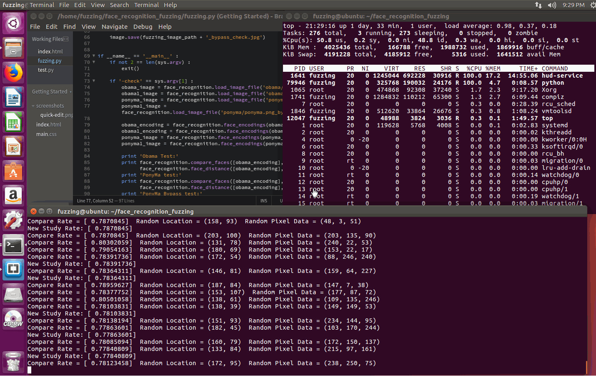
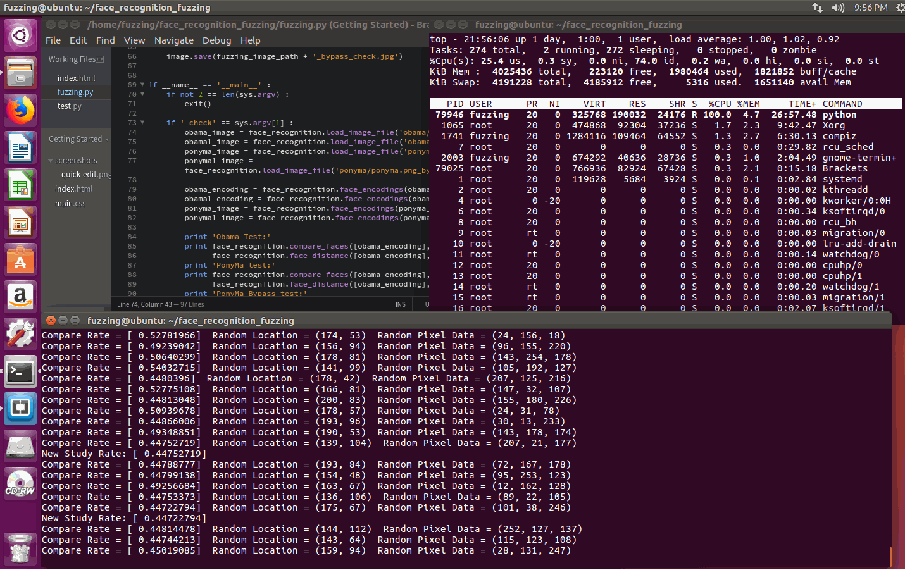
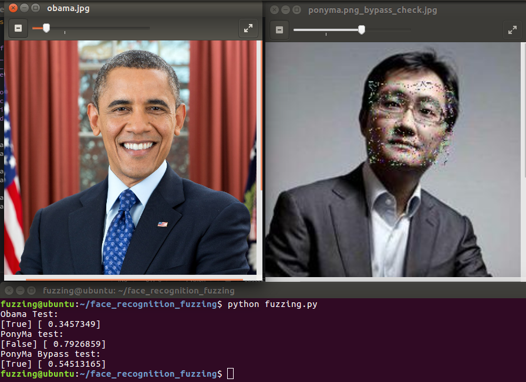
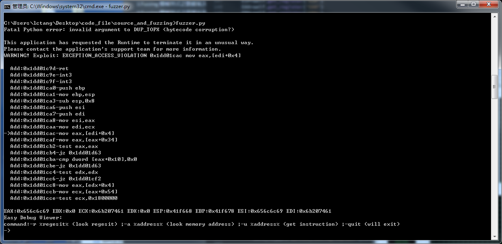
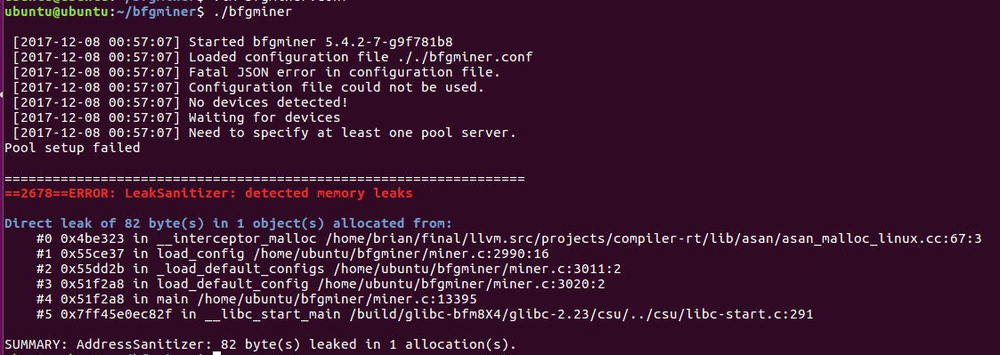
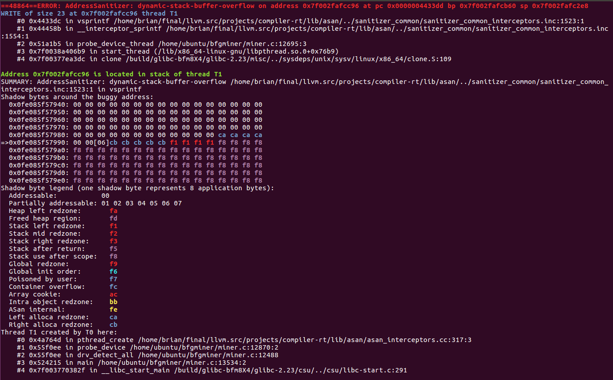

## 必备工具

  Python ,Python-face_recognition ,PHP ,Python-Requests ,Pydasm ,Pydbg


## Fuzzing 的异常检测

  上一章的结尾部分提到,程序运行包含:输入->解析->内部逻辑处理->数据组装->输出,每一个部分都可能存在漏洞.总结一下Fuzzing 的异常检测分为两种:检测输出数据异常和检测运行异常.


### 检测输出数据异常

  程序需要依赖用户输入,然后进行处理,最后再输出程序处理的数据.以人脸识别为例子,我们同样可以使用Fuzzing 来让识别算法判断两个人脸为同一个人.先来看一下Python 库`face_recognition` 是怎么做识别的.

```python

    def compare_faces(known_face_encodings, face_encoding_to_check, tolerance=0.6):
        """
        Compare a list of face encodings against a candidate encoding to see if they match.

        :param known_face_encodings: A list of known face encodings
        :param face_encoding_to_check: A single face encoding to compare against the list
        :param tolerance: How much distance between faces to consider it a match. Lower is more strict. 0.6 is typical best performance.
        :return: A list of True/False values indicating which known_face_encodings match the face encoding to check
        """
        return list(face_distance(known_face_encodings, face_encoding_to_check) <= tolerance)

```

  compare_faces() 函数根据face_distance() 函数对比两张图片的相似度做对比,当相似度小于默认值0.6 时,数值越小两张人脸越相同,即判断为同一个人.让两张不是同一个人的识别成为同一个人,本质上是干扰人脸识别算法的判断概率.**只需要对每一个像素点做极小的修改,就能影响数据点被分类的结果.必定存在一个与原本数据相差极小而被判断为任意一个类别的数据**.简单地来说,通过在脸部附近随机生成一些像素点,会影响到最终识别结果.Fuzzer 构造如下

```python

    import random

    from numpy import array
    from PIL import Image
    from PIL import ImageDraw

    import face_recognition


    def load_image_encoding(file_path) :
        image = face_recognition.load_image_file(file_path)
        image_encoding = face_recognition.face_encodings(image)[0]

        return image_encoding

    def get_face_location(file_path) :
        image = face_recognition.load_image_file(file_path)
        face_location = face_recognition.face_locations(image)[0]

        return face_location

    def fuzzing(source_image_path = 'obama/obama.jpg',fuzzing_image_path = 'ponyma/ponyma.png',target_compare_rate = 0.4) :
        source_face_data = load_image_encoding(source_image_path)
        image = Image.open(fuzzing_image_path)
        draw = ImageDraw.Draw(image)
        last_best_compare_rate = 1
        face_location = get_face_location(fuzzing_image_path)  #  获取人脸位置
        random_fuzzing_location_top = face_location[0]
        random_fuzzing_location_bottom = face_location[2]
        random_fuzzing_location_left = face_location[3]
        random_fuzzing_location_right = face_location[1]

        while True :
            random_pixel_data = (random.randint(0,255),  #  随机像素值
                                 random.randint(0,255),
                                 random.randint(0,255))
            random_location = (random.randint(random_fuzzing_location_left,random_fuzzing_location_right),  #  随机位置
                               random.randint(random_fuzzing_location_top,random_fuzzing_location_bottom))
            last_pixel_data = image.getpixel(random_location)

            draw.point(random_location,random_pixel_data)  #  在人脸的区域上随机画一个像素

            fuzzing_face_image = image.convert('RGB')
            fuzzing_face_array = array(fuzzing_face_image)
            fuzzing_face_data = face_recognition.face_encodings(fuzzing_face_array)[0]
            compare_rate = face_recognition.face_distance([source_face_data],fuzzing_face_data)  #  重新对比两个人脸

            print 'Compare Rate =',compare_rate,' Random Location =',random_location,' Random Pixel Data =',random_pixel_data

            del fuzzing_face_image  #  防止内存泄漏 ..
            del fuzzing_face_array
            del fuzzing_face_data

            if compare_rate < target_compare_rate :  #  两张人脸识别结果的判断率达到要求之后,就退出
                break

            if compare_rate < last_best_compare_rate :  #  如果随机的像素没有提升识别率,那就恢复原来的那个像素,如果有提升识别率,那就保存这个像素
                last_best_compare_rate = compare_rate

                print 'New Study Rate:' ,last_best_compare_rate
            else :
                draw.point(random_location,last_pixel_data)

        image.save(fuzzing_image_path + '_bypass_check.jpg')


    obama_image = face_recognition.load_image_file('obama/obama.jpg')
    obama1_image = face_recognition.load_image_file('obama/obama2.jpg')
    ponyma_image = face_recognition.load_image_file('ponyma/ponyma.png')
    ponyma1_image = face_recognition.load_image_file('ponyma/ponyma.png_bypass_check.jpg')

    obama_encoding = face_recognition.face_encodings(obama_image)[0]
    obama1_encoding = face_recognition.face_encodings(obama1_image)[0]
    ponyma_image = face_recognition.face_encodings(ponyma_image)[0]
    ponyma1_image = face_recognition.face_encodings(ponyma1_image)[0]

    print 'Obama Test:'
    print face_recognition.compare_faces([obama_encoding], obama1_encoding),\
          face_recognition.face_distance([obama_encoding], obama1_encoding)
    print 'PonyMa test:'
    print face_recognition.compare_faces([obama_encoding], ponyma_image),\
          face_recognition.face_distance([obama_encoding], ponyma_image)
    print 'PonyMa Bypass test:'
    print face_recognition.compare_faces([obama_encoding], ponyma1_image),\
          face_recognition.face_distance([obama_encoding], ponyma1_image)

    print 'Ready Fuzzing ..'
    
    fuzzing()

```

  运行过程与结果







  看到这里,相信读者应该理解到:**用户的输入是不可信的,精心构造的输入会影响程序的输出结果甚至远程代码执行**.下面再举一个SQL 注入的例子,先来看看页面的源码

```php

    <?php

        $connect = mysql_connect('localhost','root','root');

        mysql_select_db('test', $connect);

        $query  = 'SELECT * FROM user WHERE name = "' . $_REQUEST['name'] . '"';
        $result = mysql_query($query) or die('<pre>'.mysql_error().'</pre>');

        while($row = mysql_fetch_array($result)) {
          echo $row['0'] . ' ' . $row['1'];
          echo '<br />';
        }

        echo '<br/>';
        echo $query;
        mysql_close($connect);

    ?>

```

  访问URL:http://127.0.0.1/sql.php?name=root ,页面返回的数据如下


  此时我们在root 后面加上" ,URL 变为:http://127.0.0.1/sql.php?name=root" ,再次访问链接


  可以看到,现在SQL 语句出现异常了.对于URL 进行做SQL 注入Fuzzing ,我们通过`' "` 这两个符号插入到URL 的参数里来判断能否导致SQL 字符串闭合异常.Fuzzer 代码如下:

```python

    import sys

    import requests


    def get_url_path(url) :
        argument_offset = url.find('?')

        if -1 == argument_offset :
            return False

        url = url[ : argument_offset ]

        return url

    def get_url_argument(url) :
        argument_offset = url.find('?')

        if -1 == argument_offset :
            return False

        url = url[ argument_offset + 1 : ]
        argument = url.split('&')

        return argument

    def check_url_inject(url_path,url_argument) :
        sql_inject_flag = [ '\'' , '"' ]
        sql_inject_error_flag = 'SQL syntax'
        inject_result = False

        for url_argument_index in url_argument :
            for sql_inject_flag_index in sql_inject_flag :
                responed = requests.get(url_path + '?' + url_argument_index + sql_inject_flag_index)

                if not -1 == responed.text.find(sql_inject_error_flag) :
                    inject_result = True

                    break

        return inject_result


    if __name__ == '__main__' :
        if not 2 == len(sys.argv) :
            print 'sql.py URL'

            exit()

        url = sys.argv[1]
        url_argument = get_url_argument(url)
        url_path = get_url_path(url)

        print 'Is Inject:' ,check_url_inject(url_path,url_argument)

```

  运行结果如下


  同样的原理,我们来做WAF 检测,示例URL:https://cloud.tencent.com/ .如果URL 里面还有敏感Payload 时,腾讯云的WAF 会返回501 的回应,否则会返回正常的请求

```python

    import sys

    import requests


    def check_waf(url_path) :
        responed = requests.get(url_path + '?test=<script>')

        if 501 == responed.status_code :
            return True

        return False


    if __name__ == '__main__' :
        if not 2 == len(sys.argv) :
            print 'sql.py URL'

            exit()

        print 'Has WAF:' ,check_waf(sys.argv[1])

```

  基于这段检测数据输出的代码,我们可以来做WAF Fuzzing 测试,看看哪些Payload 是无法被拦截的,关于WAF 的Fuzzing 以后再写一些东西


### 检测运行异常

  检测运行异常在二进制上应用比较多,回顾上一章的Python 运行环境Fuzzing ,Fuzzer 只做了一个数据输入的生成,具体崩溃点还不知道在哪个位置,现在我们就使用PyDbg 和PyDasm 来自动化检测异常,关于PyDbg 我整理过一个使用文档,更多信息可以参考这里:https://github.com/lcatro/PyDbg_Document .下面使用PyDbg 来编写Python 运行环境Fuzzing 的异常检测模块
  
```python

    EXCEPTION_STACK_OVERFLOW=0xC00000FD  #  栈溢出异常,这个值PyDbg 里没有,是自己加上去的

    def get_exception(EXCEPTION) :  #  判断异常类型
        if EXCEPTION==EXCEPTION_STACK_OVERFLOW :
            return 'EXCEPTION_STACK_OVERFLOW'
        elif EXCEPTION==pydbg.defines.EXCEPTION_ACCESS_VIOLATION :
            return 'EXCEPTION_ACCESS_VIOLATION'
        elif EXCEPTION==pydbg.defines.EXCEPTION_GUARD_PAGE :
            return 'EXCEPTION_GUARD_PAGE'
        return 'Unknow Exception!'

    def get_instruction(self,address) :  #  获取指定地址附近的汇编代码
        for ins in self.disasm_around(address,10) :
            if ins[0]==address :
                print '->Add:'+str(hex(ins[0]))[:-1]+'-'+ins[1]
            else :
                print '  Add:'+str(hex(ins[0]))[:-1]+'-'+ins[1]

    def format_output(memory_data) :  #  格式化输出内存数据
        output_string=''
        for memory_data_index in memory_data :
            output_string+=str(hex(ord(memory_data_index)))+' '
        return output_string

    def dump_crash(self,EXCEPTION,EIP,EAX,EBX,ECX,EDX,ESP,EBP,ESI,EDI,instruction) :  #  输出崩溃信息
        print 'WARNING! Exploit:',get_exception(EXCEPTION),str(hex(EIP))[:-1],instruction,'\n'
        get_instruction(self,EIP)
        print ''
        print 'EAX:'+str(hex(EAX))[:-1],'EBX:'+str(hex(EBX))[:-1],'ECX:'+str(hex(ECX))[:-1],'EDX:'+str(hex(EDX))[:-1],'ESP:'+str(hex(ESP))[:-1],'EBP:'+str(hex(EBP))[:-1],'ESI:'+str(hex(ESI))[:-1],'EDI:'+str(hex(EDI))[:-1]
        print 'Easy Debug Viewer:'
        print 'command:-r %regesit% (look regesit) ;-a %address% (look memory address) ;-u %address% (get instruction) ;-quit (will exit)'

        while True :  #  这里有个内置调试器,支持一些手工调试功能
            try :
                command=raw_input('->')
                if command[:2]=='-r' :  #  获取寄存器
                    print str(hex(self.get_register(str.upper(command[3:]))))[:-1]
                elif command[:2]=='-a' :  #  获取数据
                    dump_data=self.read(eval(command[3:]),DUMP_DATA_LENGTH)
                    print format_output(dump_data)
                    print dump_data
                elif command[:2]=='-u' :  #  获取代码
                    get_instruction(self,eval(command[3:]))
                elif command[:5]=='-quit' :  #  退出
                    break
            except :
                print 'Making a Except may input a error data'

    def check_valueble_crash(self,EXCEPTION) :  #  获取异常崩溃信息
        EIP=self.get_register('EIP')
        EAX=self.get_register('EAX')
        EBX=self.get_register('EBX')
        ECX=self.get_register('ECX')
        EDX=self.get_register('EDX')
        ESP=self.get_register('ESP')
        EBP=self.get_register('EBP')
        ESI=self.get_register('ESI')
        EDI=self.get_register('EDI')
        instruction=self.disasm(EIP)

        if 'call'==instruction[0:4] :
            dump_crash(self,EXCEPTION,EIP,EAX,EBX,ECX,EDX,ESP,EBP,ESI,EDI,instruction)
        elif 'mov'==instruction[0:3] :
            dump_crash(self,EXCEPTION,EIP,EAX,EBX,ECX,EDX,ESP,EBP,ESI,EDI,instruction)
        elif 'pop'==instruction[0:3] :
            dump_crash(self,EXCEPTION,EIP,EAX,EBX,ECX,EDX,ESP,EBP,ESI,EDI,instruction)
        elif 'push'==instruction[0:4] :
            dump_crash(self,EXCEPTION,EIP,EAX,EBX,ECX,EDX,ESP,EBP,ESI,EDI,instruction)
        elif EXCEPTION==EXCEPTION_STACK_OVERFLOW :
            dump_crash(self,EXCEPTION,EIP,EAX,EBX,ECX,EDX,ESP,EBP,ESI,EDI,instruction)

    def crash_recall_guard_page(self) :  #  捕获程序异常的回调函数,参数self 是Pydbg 的对象
        check_valueble_crash(self,pydbg.defines.EXCEPTION_GUARD_PAGE)

    def crash_recall_access_violation(self) :
        check_valueble_crash(self,pydbg.defines.EXCEPTION_ACCESS_VIOLATION)

    def crash_recall_exit_process(self) :
        check_valueble_crash(self,pydbg.defines.EXIT_PROCESS_DEBUG_EVENT)

    def crash_recall_stack_overflow(self) :
        check_valueble_crash(self,EXCEPTION_STACK_OVERFLOW)


    if __name__ == '__main__' :
        while True :
            code_object = make_code_object(make_opcode_stream())

            save_to_pyc('python_fuzzing.tmp.pyc',code_object)

            debugger = pydbg.pydbg()  #  初始化PyDbg

            debugger.set_callback(pydbg.defines.EXCEPTION_ACCESS_VIOLATION,crash_recall_access_violation)  #  设置异常回调
            debugger.set_callback(pydbg.defines.EXCEPTION_GUARD_PAGE,crash_recall_guard_page)
            debugger.set_callback(pydbg.defines.EXIT_PROCESS_DEBUG_EVENT,crash_recall_exit_process)
            debugger.set_callback(EXCEPTION_STACK_OVERFLOW,crash_recall_stack_overflow)

            debugger.load('C:\\Python27\\python.exe','python_fuzzing.tmp.pyc')  #  把生成的样本传递进来Fuzzing
            debugger.run()  #  启动调试

            time.sleep(3)

            del debugger  #  删除PyDbg

```

  运行效果



  PyDbg 不是一个好的选择,因为有一些buffer overflow 必须要改写到其他数据并且又要被引用才会触发异常,事实上有很多情况是越界读写并没有被检测出来.最好的选择还是使用ASAN ,ASAN 自带有很强大的内存检测方式,ASAN 需要在编译的时候使用`-fsanitize=address` 参数引入,但是使用ASAN 需要依赖源码.在没有源码只有执行文件的情况下,linux 平台使用valgrind ,windows 平台使用gflags 来做内存异常检测.

  使用ASAN 做检测就方便很多了,下面是ASAN 检测内存泄漏和越界的例子(检测程序为bfgminer)





